<div align="center">

# CareerHive


</div>

> AI-powered career assistant — resume analysis, job matching, and interview prep. No recruiter required.

---

## Live Demo
**[CareerHive Live Demo](https://blue-desert-0dd81d900.7.azurestaticapps.net)**
## Demo Video
[Youtube](youtube.com)
## Live Walkthrough
### Landing
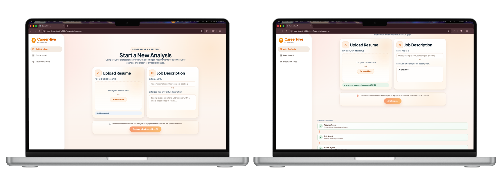
### Pipeline
The multi-agent pipeline shows how each agent works with each other to create a personalized report.
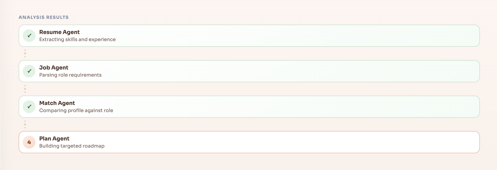
### Results
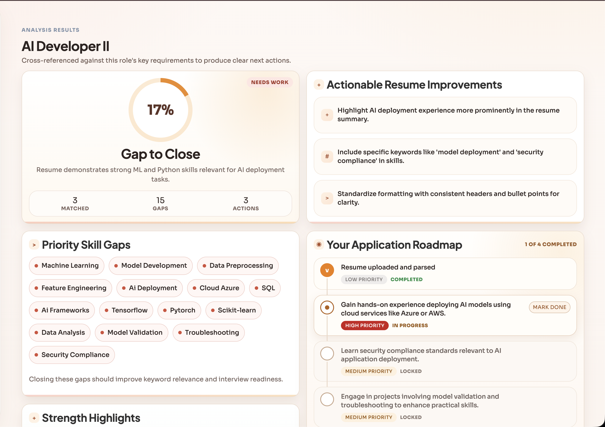 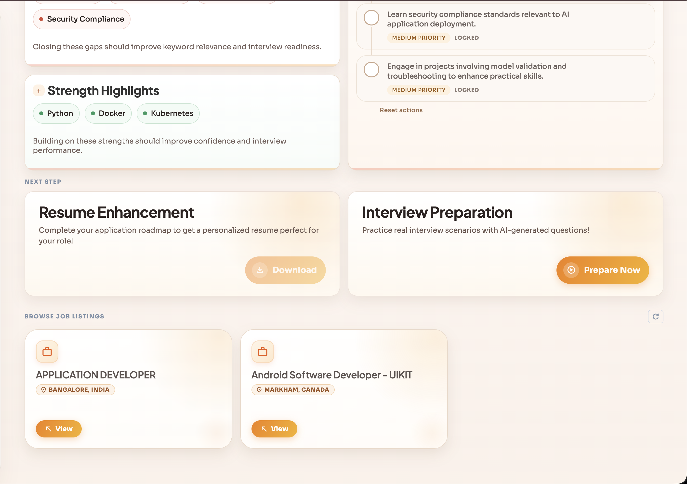
### Interview Preparation
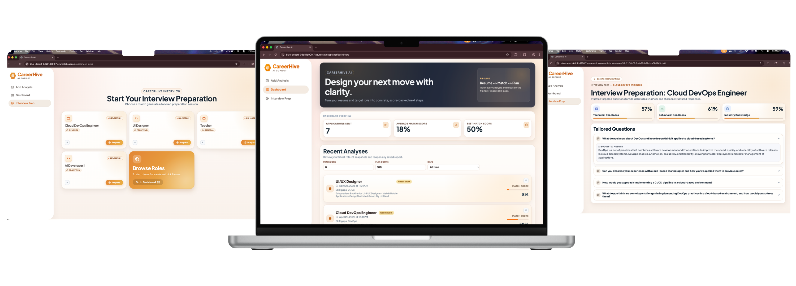
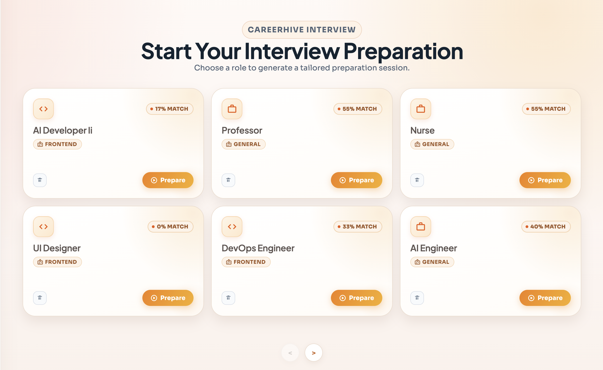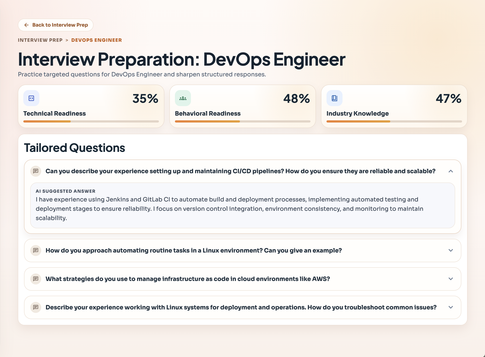
### Dashboard
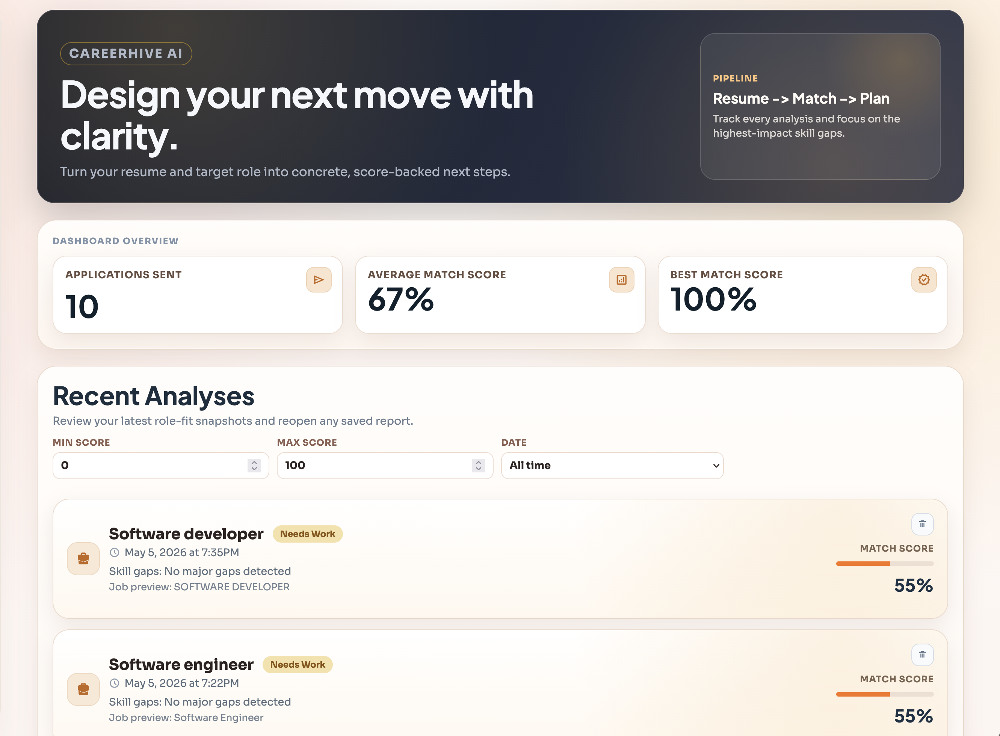 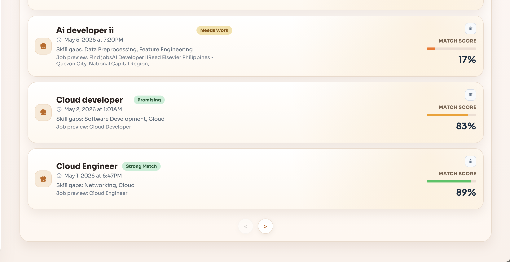 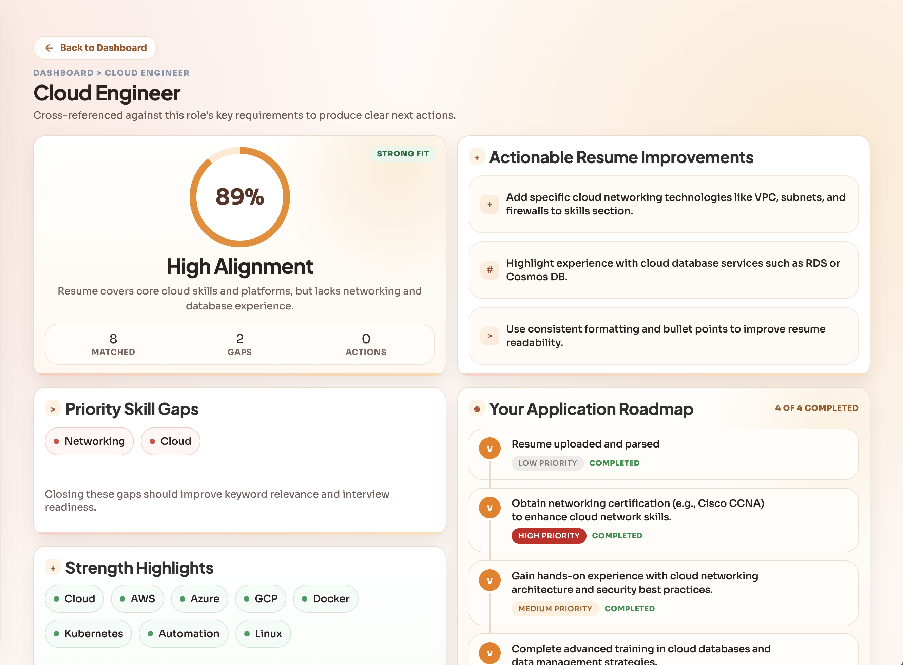
### Browse Job Listings
Browse **live** job listings from The Muse API.
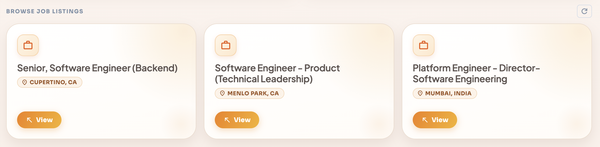
### Enhanced Resume
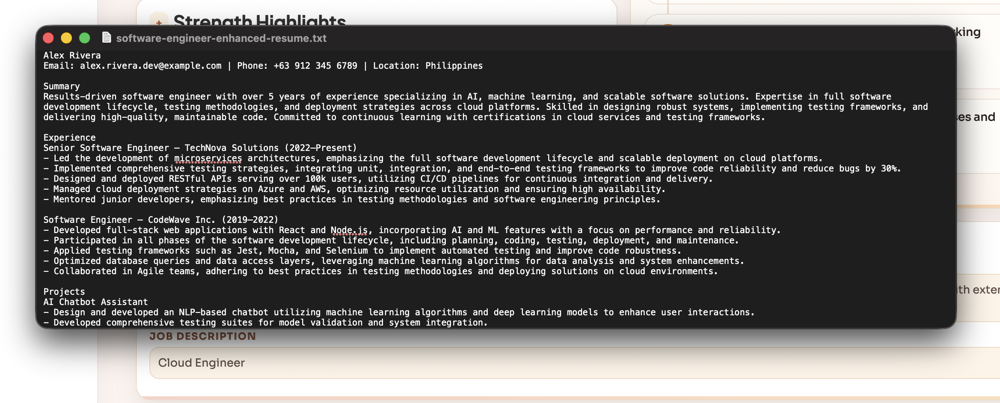

---

## Problem
Job seekers operate largely in the dark. This creates real friction:

- **No resume feedback** — candidates don't know why they're being rejected or what's missing
- **Manual job hunting** — scrolling dozens of boards with no relevance scoring or gap analysis
- **No interview prep** — walking into interviews blind to your own skill gaps vs. the job requirements
- **Resume guesswork** — generic templates that aren't tailored to the specific role or domain
- **Disconnected tools** — parsing, matching, coaching, and editing all live in separate products

Employers face the mirror problem: inbound applications that don't map to what the role actually needs.

---

## Solution

CareerHive puts a full AI career coaching pipeline into a single upload. Paste a job URL, drop your resume, and get a complete readout in seconds — skill gaps scored, interview questions generated, resume rewrites suggested, all grounded in the actual job description.

- Upload resume (PDF or DOCX) → extract skills, experience, metrics automatically
- Paste a job URL → scrape and parse the full posting with Cheerio
- 5-stage MAF pipeline → match, plan, prep, and enhance in one round trip

Every analysis is stored in Azure Cosmos DB so your history is always there.

---

## Core Features

### Resume Analysis

- **PDF & DOCX upload** — in-memory parsing via pdf-parse and Mammoth, no storage required
- **Skill extraction** — canonical skill normalization across synonyms and aliases
- **Gap scoring** — maps your profile against the job's requirements with match percentages
- **Experience parsing** — pulls out roles, timelines, and measurable metrics automatically

### Job Discovery

- **Live listings** — The Muse API delivers fresh postings filtered by role
- **Deep scraping** — Cheerio extracts full job description context beyond the API summary
- **Match ranking** — listings scored against your extracted resume profile
- **Memo field** — log what you applied for, visible in history

### Interview Prep

- **Tailored questions** — technical and behavioral questions mapped to your specific gaps
- **Role-aware depth** — questions reflect the seniority and domain of the target job
- **Weakness targeting** — hardest questions focus on the skills you're missing, not ones you have

### Resume Enhancement

- **Rewrite suggestions** — concrete line-level edits targeting the job domain
- **Strength-gap bridging** — surfaces transferable skills you're underselling
- **Per-job targeting** — each enhancement run is scoped to a specific posting, not generic advice

---

## App Flow

```
1. Upload resume (PDF / DOCX)
        ↓
2. Browse jobs or enter job title 
        ↓
3. Select a job → Cheerio scrapes the full description
        ↓
4. Option: run App Agent → automatically enhance the uploaded resume for the selected job (automated rewrite + metrics)
        ↓
5. MAF pipeline fires (5 sequential agents):
   extract_resume → extract_job → analyze_combined → plan → enhance_resume
        ↓
6. Results returned:
   • Match score + skill gap breakdown
   • Short-term career roadmap
   • Tailored interview questions
   • Enhanced resume with automated edits applied
   • Browse live job listings from The Muse
        ↓
7. Session saved to Cosmos DB → accessible from history
```

---

## Next Phase

- [ ] Real-time streaming responses — show pipeline progress as each agent completes
- [ ] Multi-resume comparison — run two resume versions against the same job side-by-side
- [ ] LinkedIn import — parse profile URL as an alternative to file upload
- [ ] Saved job board — bookmark listings and track application status
- [ ] Auth + user accounts — persistent profiles with cross-device history
- [ ] Cover letter generation — draft from the same gap analysis already computed
- [ ] Bulk apply mode — run the full pipeline across multiple jobs in one session

---

## Local Setup

Prerequisites: Node.js v18+, Python 3.10+, active Azure subscription with OpenAI and Cosmos DB deployed.

<details>
<summary><strong>Backend (Node.js / Express)</strong></summary>

```bash
cd careerhive/backend
npm install
```

Create `.env`:

```env
COSMOS_CONNECTION_STRING=your_cosmos_connection_string
COSMOS_DB_NAME=jobpilot
COSMOS_CONTAINER_NAME=analyses
MAF_SERVICE_URL=http://localhost:8000
LLM_PROVIDER=maf
MUSE_API_KEY=your_muse_api_key
```

```bash
npm run dev
# Runs on http://localhost:3000
```

</details>

<details>
<summary><strong>MAF Service (Python / FastAPI)</strong></summary>

```bash
cd careerhive/maf-service
pip install -r requirements.txt
```

Create `.env`:

```env
AZURE_OPENAI_ENDPOINT=https://your-resource.openai.azure.com/
AZURE_OPENAI_API_KEY=your_api_key
AZURE_OPENAI_DEPLOYMENT=gpt-4
AZURE_OPENAI_API_VERSION=2024-12-01-preview
```

```bash
sh startup.sh
# Runs on http://localhost:8000
```

</details>

<details>
<summary><strong>Frontend (Vite)</strong></summary>

```bash
cd careerhive/frontend
npm install
```

Create `.env`:

```env
VITE_API_URL=http://localhost:3000
```

```bash
npm run dev
# Runs on http://localhost:5173
```

</details>
